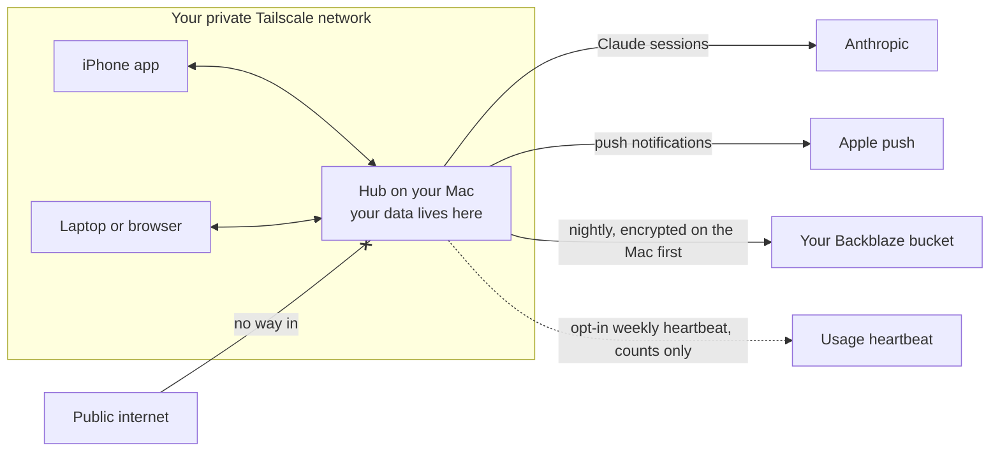

<p align="center"></p>

# life

**One prompt to Claude Code builds you *life*: a personal AI agent with apps on your iPhone, Mac and web.**

*life* is a self-hosted AI assistant built on [Claude Code][claude-code]. It
runs on a Mac you own, works on your goals day and night, and reaches you
through its own iPhone app, a desktop app and a web console. Think apps you
can edit like dashboards, plus an agent that connects to your data sources
and does the work. A very powerful personal assistant, and it's yours.

**You need:** a personal computer that is always on (a Mac), an
[Apple Developer membership][apple-dev] ($99 a year, for the iPhone and
desktop apps), and a [Claude subscription][claude-pricing] that works with
Claude Code (about $20 to $200 a month, depending on plan).

## Install: paste one sentence

```
Clone github.com/mattabate/life-distributable and set up my life agent. Follow its SETUP.md.
```

Setup takes **about 2 hours**, mostly waiting on Apple and the Xcode
download. The agent runs the Terminal for you. Your part is clicking where
it tells you. You never type a command.

⭐ **[Star it][repo]** to get developer addenda: new features and fixes land
in [ADDENDA.md](ADDENDA.md), and your agent brings each one to you.

<p align="center"></p>

**Configuration.** What it is connected to, what it may spend, and what you are working toward: the Claude plan and how much of each limit is left, the model new sessions start on, your goals, and every data source with its last sync.

<p align="center"></p>

## Is this for me?

Yes, if you want an AI agent that actually does things, not a chat window
you have to babysit. You don't need to be technical. You need:

- **A Mac that stays on.** A Mac mini is ideal. A laptop works if it stays
  plugged in and awake.
- **A Claude subscription.** Pro works. Max is better for an agent that
  runs all day.
- **Claude Code installed.** [Here is how][claude-code-setup]. It's one
  line to paste, and it's the only one you paste yourself.

### Your first five minutes

1. Open **Terminal**: press **Cmd-Space**, type `Terminal`, press **Return**.
2. If you don't have Claude Code yet, install it with
   [Anthropic's guide][claude-code-setup].
3. In Terminal, type `claude` and press **Return**. Sign in with your
   Claude account if it asks.
4. Paste the sentence above and press **Return**.
5. From here, the agent leads. Do what it says, click where it points.

## What it does

- **Runs sessions for every part of your life.** Long-running Claude Code
  sessions, one per project, habit or question. They keep full memory and
  keep working while you sleep.
- **Puts a card on your phone when it needs you.** One clear thing to do,
  decide or read. Everything else it handles itself.
- **Asks before anything that matters.** Money, deleting, contacting
  people, sharing data and code commits wait for your approval, with a code
  only you hold.
- **Tracks your goals.** Sessions file what they learn under each goal, so
  every goal has a living "where this stands".
- **Recommends, with receipts.** Every suggestion goes in a ledger with its
  evidence and the price, so you can see later whether it worked.
- **Four pages, on the web and on the phone.** Sessions, Recs and Calendar
  are the pages you live in. Configuration holds your goals, your spend
  limits and the data sources it is connected to.
- **Grows with you.** Ask for a new data source, a page or an automation,
  and it builds it in your own copy of the code. A page for a part of your
  life (money, a training log, a reading list) is something your agent
  builds for a goal when that goal needs one. None ships in the box.

## Screenshots

| **Approvals.** The agent proposes, you approve. | **Sessions.** It asks one clear question at a time. |
|---|---|
|  |  |

| **Recs.** Suggestions with evidence and a price. | **Calendar.** Your steps and the agent's runs. |
|---|---|
|  |  |

<table>
<tr>
<th align="left"><strong>iPhone: an approval.</strong> The same card, in your pocket.</th>
<th align="left"><strong>iPhone: Sessions.</strong> Every card waiting on you.</th>
<th align="left"><strong>iPhone: Calendar.</strong> Overdue, due today, do soon.</th>
</tr>
<tr>
<td valign="top"></td>
<td valign="top"></td>
<td valign="top"></td>
</tr>
</table>

All screenshots use a made-up owner and made-up data.

## What it costs

| What | Cost | Needed for |
|---|---|---|
| [Claude Pro or Max][claude-pricing] | $20, $100 or $200 a month | Everything. Max is better for an always-on agent |
| [Apple Developer Program][apple-dev] | $99 a year | Only the iPhone app and the desktop app. Web only? Skip it |
| [Tailscale](https://tailscale.com/pricing) | free | Reaching your hub privately from your phone and laptops |
| [Backblaze B2](https://www.backblaze.com/cloud-storage/pricing) | cents a month | Nightly encrypted backup |
| A Mac | the one you own | The hub |

## Setup, in order

The agent follows [SETUP.md](SETUP.md). Here is the timeline.

1. **Pick your apps, see the costs** (2 min). iPhone, desktop, web, or all three.
2. **Start the slow things** (10 min, then waiting). Apple developer
   enrollment and the Xcode download start first. Apple usually answers
   within hours.
3. **Prepare the Mac** (10 min). Free tools, never sleep, disk encryption on.
4. **Your private copy on GitHub** (5 min). Your copy, your account, private.
5. **Tailscale** (10 min). A private network only your devices can join.
6. **The hub is up** (10 min). First milestone: the web console works.
7. **Backups** (15 min). Nightly, encrypted, to storage you own, tested
   with a real restore.
8. **Apple team and Xcode** (10 min). Once Apple says yes.
9. **The apps** (20 min). The desktop app opens, the iPhone app installs
   and buzzes.
10. **Your first goals** (15 min). The agent interviews you.
11. **Weekly updates and wrap-up** (5 min).

## How security works

Your data lives on your Mac. The hub listens only on your private
[Tailscale](https://tailscale.com) network, so nothing about it is public.



- **Nothing public.** No open ports, no public URL. Your phone reaches the
  hub through Tailscale.
- **Outbound, only three places:** Anthropic (your Claude sessions), Apple
  (push notifications), and an optional weekly heartbeat.
- **The heartbeat is off unless you say yes.** The agent asks once at
  setup, and the answer defaults to no. If you say yes, it sends a random
  install id, the version and a few counts. Never text, titles, names or
  amounts. You can switch it off in Settings.
- **Backups are yours.** Encrypted on your Mac before upload, so the
  storage only ever sees noise. The nightly key can't delete anything.
- **The gate.** Anything that spends money, deletes, contacts a person,
  shares data or commits code needs your approval plus a decider code that
  only you hold. No session can approve itself.

## Updates and addenda

- **The copy is yours.** Setup makes a private copy in your GitHub account.
  Change anything.
- **Upstream is read-only.** Nothing from this repo lands in your copy
  without your yes.
- **Your agent checks weekly.** It reads [ADDENDA.md](ADDENDA.md) every
  Monday and shows each new entry as a card on your phone.
- **Nothing merges without you.** Say yes on a card and it applies that
  one update, tests it, and tells you what changed.

## What you need

- A Mac on macOS 15 or later that stays on
- A Claude Pro or Max subscription, with [Claude Code][claude-code-setup]
- An Apple Developer membership, for the iPhone and desktop apps
- An iPhone, if you want the phone app
- About 2 hours, mostly waiting

## FAQ

**Do I need to know how to code?**
No. The agent runs every command. You click, copy and paste where it tells you.

**Is my data sent anywhere?**
Your Claude sessions go to Anthropic, like any Claude Code session. Push
notifications go through Apple. Backups go to your own Backblaze bucket,
encrypted first. Nothing else, unless you opt in to the counts-only heartbeat.

**Can I skip the iPhone app?**
Yes. Pick web only and skip the Apple Developer membership. The console
works in any browser on your Tailscale network, phone included.

**Does it run on Windows or Linux?**
The hub needs a Mac. Once it runs, the web console works from any device on
your Tailscale network.

**Can the agent spend my money or email people on its own?**
No. Those actions are gated. It proposes, you approve with your decider code.

**Is this an Anthropic product?**
No. It's an independent open source project built on Claude Code.

**How do I get new features?**
They're announced in [ADDENDA.md](ADDENDA.md). Your agent brings each one
to you as a card, and you choose.

## Who made this

[Matt Abate](https://mattabate.com). Questions and ideas:
[open an issue][issues]. Want it set up for you or your team? Get in touch
through [mattabate.com](https://mattabate.com).

## License

MIT. See [LICENSE](LICENSE).

[repo]: https://github.com/mattabate/life-distributable
[issues]: https://github.com/mattabate/life-distributable/issues
[claude-code]: https://claude.com/claude-code
[claude-code-setup]: https://code.claude.com/docs/en/setup
[claude-pricing]: https://claude.com/pricing
[apple-dev]: https://developer.apple.com/programs/
